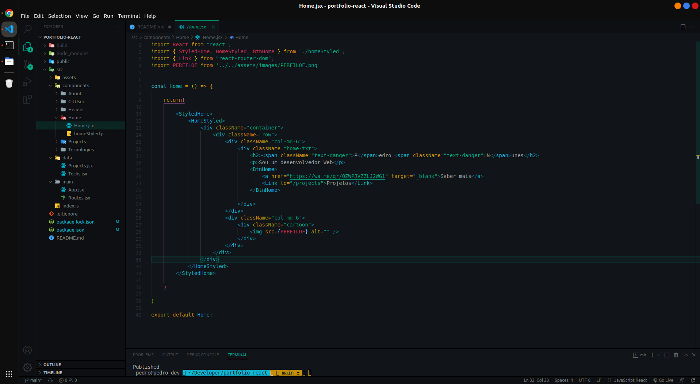

    <h1> 🚧 Em Construção</h1>
    <h3>Esta é a nova versão do meu portfólio, criado com ReactJs, uso de API's como: </h3>
    
✳️ Api do GitHub Users

    
✳️ Api do GitHub Repositories

    
✳️ Api data projects

    
✳️ Api data techs

 

<h1>🧱 Estrutura</h1>

    

 

    <h1> 🚧 Features</h1>
    

        <input type="checkbox"/> 
        <label>Adicionar Footer<label/>
    

    

        <input type="checkbox"/> 
        <label>Adicionar página de contato<label/>
    

    

        <input type="checkbox"/> 
        <label>Back-end para validação e envio de formulário<label/>
    

    

        <input type="checkbox"/> 
        <label>Acessibilidade<label/>
    

    

        <input type="checkbox"/> 
        <label>Refatoração e melhorias<label/>
    

